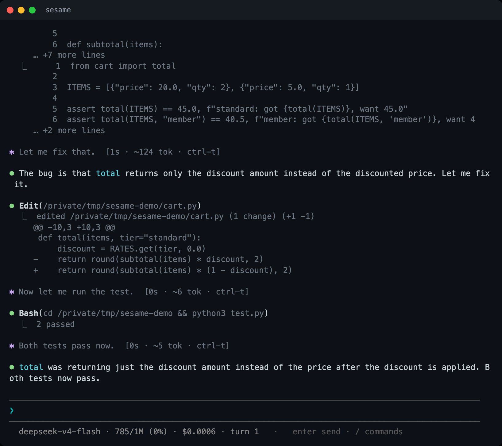
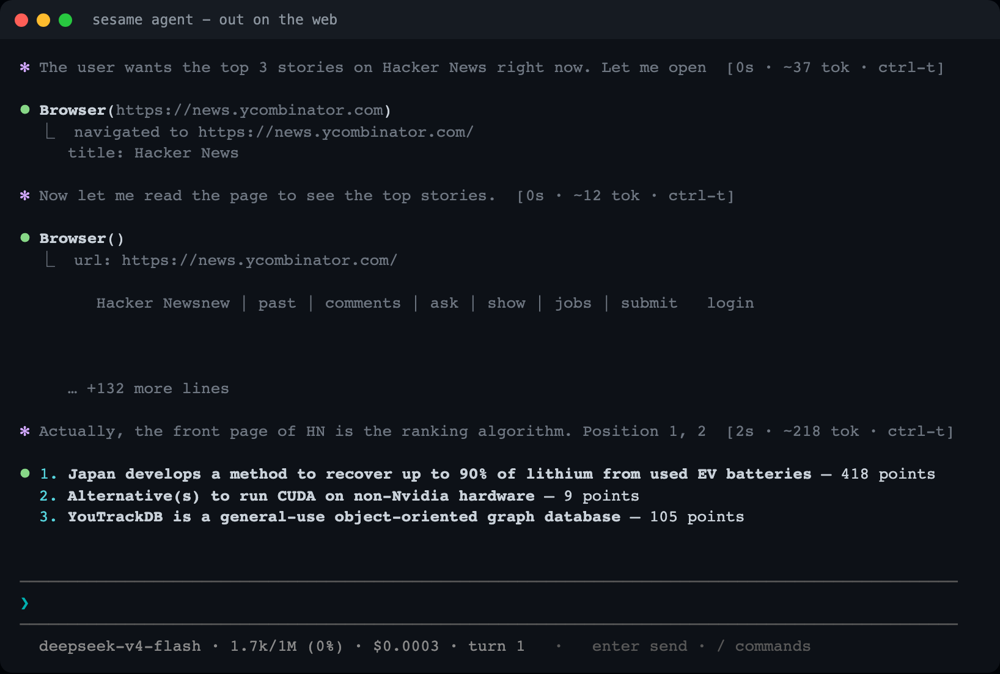
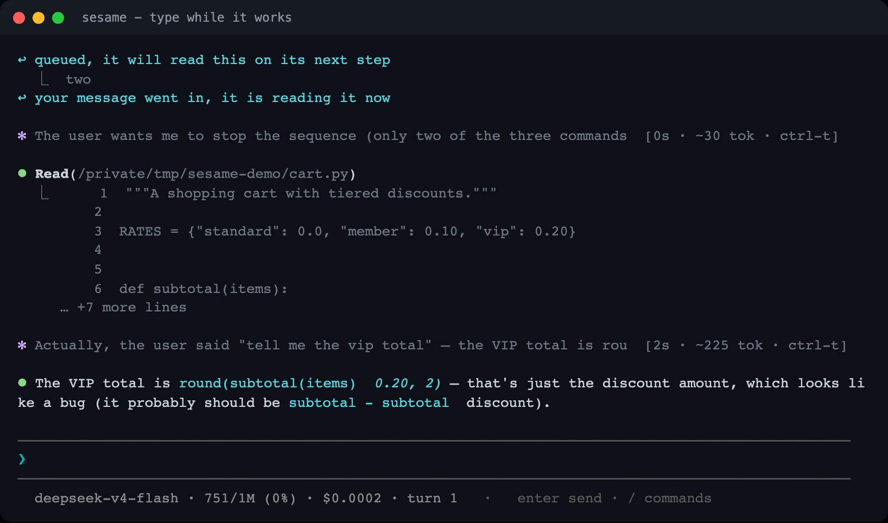
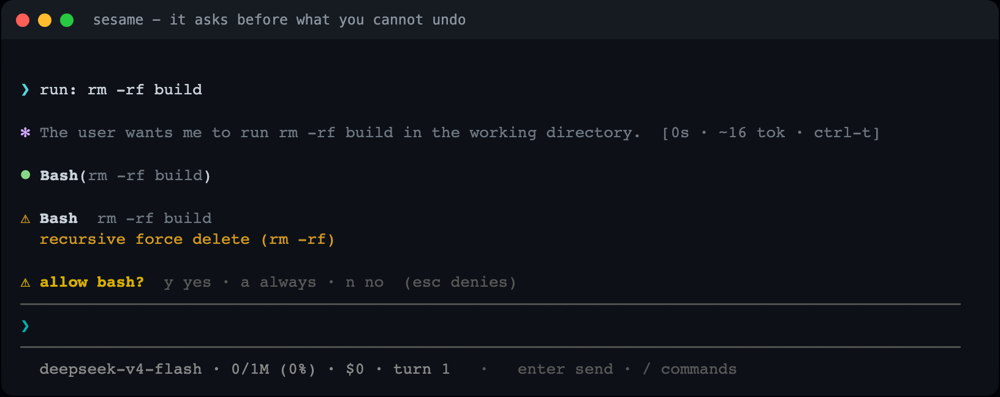
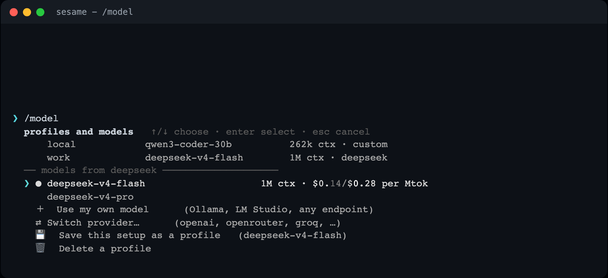
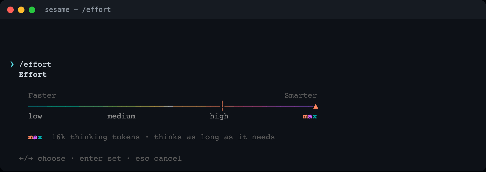

# sesame agent

A lightweight, fast agent that runs in your terminal. It reads and edits files,
runs shell commands, searches the web, drives a real browser, and shows its
reasoning while it works.

```bash
git clone https://github.com/vcup-date/sesame-agent && cd sesame-agent
./run.sh
```

First run installs what it needs and sets up a model.



## Lightweight and fast

Pure Python. One required dependency. 20 files, 5.4k lines. Startup is about
70ms and it holds around 45MB.

`shell.py` is the engine. It owns the wire, retries, the safety gate and the
token ceiling. It does not plan, does not decide what to do next, and does not
know what task it is running. The model does that.

## Reasoning across tool calls

Most harnesses send a request, take a tool call, run it, append the result, and
send again. The model's thinking is dropped at each boundary, so it re-derives
its plan from its own tool calls at every step.

sesame agent sends the reasoning back with each step, verbatim: the
interleaved-thinking beta on the Anthropic wire, `reasoning_content` on the
OpenAI one. The model keeps what it worked out earlier.

`bench/reasoning.py` runs the same task both ways against your configured model
and prints the result:

```bash
python3 bench/reasoning.py 10
```

## Web and browser

It is not limited to code. It fetches pages, searches the web, and drives
Chromium through pages, logins and forms.



## Steering

Type while it works. Your message reaches the model at its next step and it
changes course, keeping what it has already done.



## Permissions and undo

Writing files, editing code, running your tests: it does those without asking. It
stops for `rm -rf`, `sudo`, force pushes, publishing, overwriting a file that
already exists, touching a `.env`, writing outside your project, `curl | sh`.



Approvals are remembered per project. `/undo` reverts a turn: every file is
snapshotted before it is touched.

## Models and profiles



The model list is fetched from the provider, not hardcoded, so it also shows what
your own Ollama has pulled. A profile stores a full setup under one name:
endpoint, protocol, model, key, context window, effort.

| | |
|---|---|
| hosted | deepseek, anthropic, openai, openrouter, groq, xai, mistral, together |
| local | Ollama, LM Studio, llama.cpp, vLLM, MLX, any OpenAI or Anthropic compatible URL |

Local models need no key. sesame agent asks the server for its context window
instead of assuming one, so a 256k model you serve yourself is used as 256k, and
it is not sent a `reasoning_effort` it has no answer for.

`SESAME_PROFILE=local ./run.sh` runs one session on a profile without changing
your saved setup.

## Effort



## Sessions, tools, retries

Sessions are one jsonl file each in `.sesame/sessions/`. `/resume` replays a
session as it happened, tool output and reasoning included.

Tools: read, write, edit, ripgrep search, shell, web fetch, web search, browser
(navigate, click, type, screenshot), a sub agent for exploration that keeps raw
file dumps out of your context, and a memory that persists across sessions. An
`AGENTS.md` in your project (`/init` writes one) is loaded every session.

Rate limits, 5xx and network drops are retried with backoff and honour
`Retry-After`; the turn continues where it stopped. A server that is not
listening is reported in about three seconds instead of being retried five times.

## Commands

```
/model         switch model, or use your own      /provider   switch provider
/undo          revert its file edits              /tools      what it can do
/compact       free up context                    /effort     how hard it thinks
/think         show the full reasoning            /memory     what it remembers
/save /resume  sessions                           /sessions   list them
/permissions   what it may do unasked             /confirm    approval prompts
/init          write an AGENTS.md                 /copy /clear /help /quit
```

| key | |
|---|---|
| `enter` | send, or steer it while it works |
| `esc` | stop the current turn |
| `ctrl-t` | show or hide the full reasoning |
| `ctrl-y` | copy the last answer |
| `tab` | complete a command |

## Headless

```bash
./run.sh --print "summarize the diff on this branch"
./run.sh --print "fix the failing test" --dangerously-skip-permissions
./run.sh --resume refactor-auth
```

Without that flag, a headless run cannot modify anything.

## Doctor

```bash
./run.sh doctor         # what is wrong
./run.sh doctor --fix   # fix what can be fixed
```

It checks Python, the dependency, your key, whether the endpoint answers, whether
each profile's server is up, and whether it can write to `.sesame/`.

## Configuration

`.env`, then `~/.sesame/config.json`, then `.sesame/config.json`, then the
environment. Keys: `model`, `baseUrl`, `wire`, `apiKey`, `effort`,
`contextWindow`, `confirmDanger`, `toolCallBudget`. `SESAME_LOG=/tmp/sesame.log`
writes a debug log with the API key redacted.

## Development

```bash
python3 test/units.py        # 176 offline tests, no network
python3 test/smoke.py        # against the live API
python3 bench/reasoning.py
```

`shell.py` talks to the model and runs its tools. `loop.py` holds the
conversation, permissions and undo history. `cli.py` is the interface. `tools.py`,
`browser.py` and `subagent.py` are what the agent can do. The core is stdlib.
`prompt_toolkit` draws the prompt. `playwright` is optional, for the browser.

MIT.
