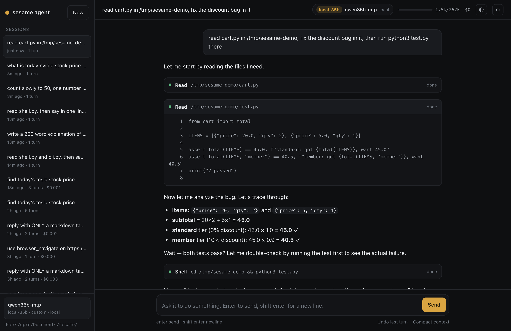
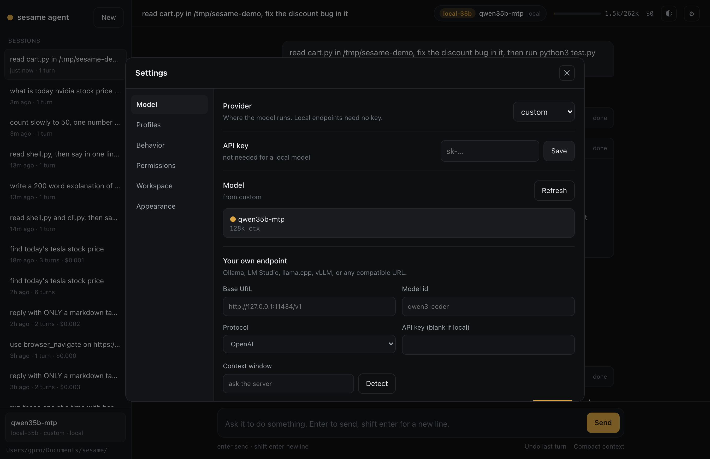

# sesame agent

sesame agent is an agent you can put to work. Give it a task in your terminal or
your browser and it goes and does it: reads and edits your files, runs commands,
searches the web, drives a real browser, and shows you its thinking as it goes.

**Using a coding agent?** Give it [SETUP.md](SETUP.md) and it will install,
configure and launch this for you:

```
install https://github.com/vcup-date/sesame-agent by following its SETUP.md
```

Doing it yourself:

```bash
git clone https://github.com/vcup-date/sesame-agent && cd sesame-agent
./run.sh
```

First run installs what it needs and sets up a model.


## In a browser

```bash
./run.sh web            # http://127.0.0.1:9981
```

The same core, the same tools, the same session files. It is not a terminal being
scraped: the web server drives the agent directly.



Streaming reasoning you can open, tool calls with their output and diffs,
permission prompts with allow once / always / deny, steering while it works,
sessions, undo, and every setting in one place: provider, key, model, your own
endpoint, profiles, effort, permissions, working folder, theme and text size.

When the model is local and its server reports progress (llama.cpp does), the
status line shows the context being read, the rate, and how much of the prompt was
served from cache, instead of a spinner.



## Lightweight and fast

Pure Python. One required dependency. 20 files, 5.4k lines. Startup is about
70ms and it holds around 45MB.

`shell.py` is the engine. It owns the wire, retries, the safety gate and the token
ceiling. It does not plan, does not decide what to do next, and does not know what
task it is running. The model does that.

Its reasoning is sent back with each request rather than dropped at the tool
boundary: thinking blocks verbatim, with the interleaved-thinking beta on the
Anthropic wire and `reasoning_content` on the OpenAI one. A server that refuses the
field is remembered and gets the plain shape instead. `test/reasoning.py` shows what
this changes: the model can still name a number it chose inside its reasoning and
never said out loud, after a tool call. On ordinary work it makes no measurable
difference to speed or to the result, so it is a property, not a selling point.

## Web and browser

It is not limited to code. It fetches pages, searches the web, and drives
Chromium through pages, logins and forms.


## Steering

Type while it works. Your message reaches the model at its next step and it
changes course, keeping what it has already done.


## Permissions and undo

Writing files, editing code, running your tests: it does those without asking. It
stops for `rm -rf`, `sudo`, force pushes, publishing, overwriting a file that
already exists, touching a `.env`, writing outside your project, `curl | sh`.


Approvals are remembered per project. `/undo` reverts a turn: every file is
snapshotted before it is touched.

## Models and profiles


The model list is fetched from the provider, not hardcoded, so it also shows what
your own Ollama has pulled. A profile stores a full setup under one name:
endpoint, protocol, model, key, context window, effort.

| | |
|---|---|
| hosted | deepseek, anthropic, openai, openrouter, groq, xai, mistral, together |
| local | Ollama, LM Studio, llama.cpp, vLLM, MLX, any OpenAI or Anthropic compatible URL |

Local models need no key. sesame agent asks the server for its context window
instead of assuming one, so a 256k model you serve yourself is used as 256k, and
it is not sent a `reasoning_effort` it has no answer for.

`SESAME_PROFILE=local ./run.sh` runs one session on a profile without changing
your saved setup.

## Effort


## Sessions, tools, retries

Sessions are one jsonl file each in `.sesame/sessions/`. `/resume` replays a
session as it happened, tool output and reasoning included.

Tools: read, write, edit, ripgrep search, shell, web fetch, web search, browser
(navigate, click, type, screenshot), a sub agent for exploration that keeps raw
file dumps out of your context, and a memory that persists across sessions. An
`AGENTS.md` in your project (`/init` writes one) is loaded every session.

Rate limits, 5xx and network drops are retried with backoff and honour
`Retry-After`; the turn continues where it stopped. A server that is not
listening is reported in about three seconds instead of being retried five times.

## Commands

```
/model         switch model, or use your own      /provider   switch provider
/undo          revert its file edits              /tools      what it can do
/compact       free up context                    /effort     how hard it thinks
/think         show the full reasoning            /memory     what it remembers
/save /resume  sessions                           /sessions   list them
/permissions   what it may do unasked             /confirm    approval prompts
/init          write an AGENTS.md                 /copy /clear /help /quit
```

| key | |
|---|---|
| `enter` | send, or steer it while it works |
| `esc` | stop the current turn |
| `ctrl-t` | show or hide the full reasoning |
| `ctrl-y` | copy the last answer |
| `tab` | complete a command |
| paste | 3 lines or more becomes one object in the input; backspace removes the whole thing |

## Headless

```bash
./run.sh --print "summarize the diff on this branch"
./run.sh --print "fix the failing test" --dangerously-skip-permissions
./run.sh --resume refactor-auth
```

Without that flag, a headless run cannot modify anything.

## Doctor

```bash
./run.sh doctor         # what is wrong
./run.sh doctor --fix   # fix what can be fixed
```

It checks Python, the dependency, your key, whether the endpoint answers, whether
each profile's server is up, and whether it can write to `.sesame/`.

## Configuration

`.env`, then `~/.sesame/config.json`, then `.sesame/config.json`, then the
environment. Keys: `model`, `baseUrl`, `wire`, `apiKey`, `effort`,
`contextWindow`, `confirmDanger`, `toolCallBudget`. `SESAME_LOG=/tmp/sesame.log`
writes a debug log with the API key redacted.

## Development

```bash
python3 test/units.py        # 176 offline tests, no network
python3 test/smoke.py        # against the live API
```

`shell.py` talks to the model and runs its tools. `loop.py` holds the
conversation, permissions and undo history. `cli.py` is the interface. `tools.py`,
`browser.py` and `subagent.py` are what the agent can do. The core is stdlib.
`prompt_toolkit` draws the prompt. `playwright` is optional, for the browser.

MIT.
